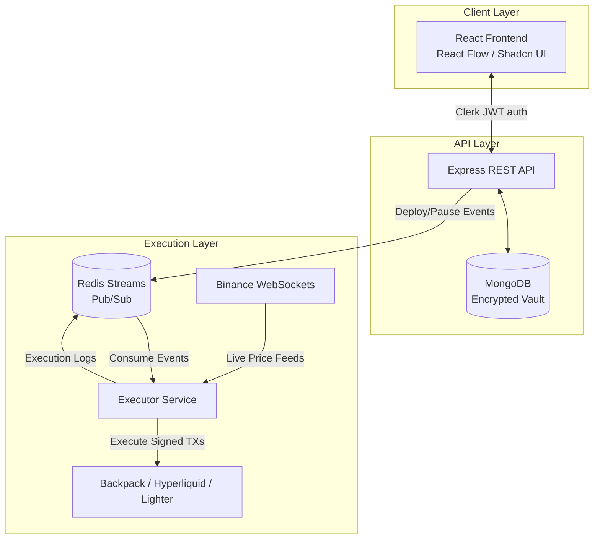

<div align="center">
  <br />
  <h1>
    
    
    <span style="vertical-align: middle;">FlowTrade</span>
  </h1>
  <p><strong>A high-performance, node-based automation engine for Web3 trading.</strong></p>
  <p>
    
    
    
    
    
  </p>
</div>

<hr />

## Overview

FlowTrade is a visual, algorithmic trading automation platform inspired by tools like n8n and Zapier, but purpose-built for low-latency crypto execution. It allows traders to design, deploy, and monitor complex trading strategies using a drag-and-drop interface, without writing a single line of code.

Under the hood, it utilizes a completely decoupled architecture. The frontend and REST API are separated from the headless execution engine via Redis Streams, ensuring that UI traffic never impacts the latency of live trades.

## Key Features

* **Visual Workflow Builder:** Drag-and-drop interface powered by React Flow to map out complex execution logic.
* **Bank-Grade Credential Vault:** API keys and wallet private keys are encrypted at rest using AES-256-GCM. Plaintext secrets are never stored in the database.
* **Decoupled Execution Engine:** A high-performance Node.js background worker processes workflows in milliseconds.
* **Real-Time Data Feeds:** Native integration with Binance WebSockets for zero-latency price triggers.
* **Multi-Exchange Execution:** Native protocol-level support for top Web3 exchanges:
  * **Backpack Exchange** (ED25519 signatures)
  * **Hyperliquid** (L1 mainnet execution)
  * **Lighter** (Orderbook DEX)
* **Automated Alerting:** Integrated `nodemailer` pipeline to instantly email users upon execution failures.

## Architecture



## Monorepo Structure

This project uses npm workspaces to manage a modular, decoupled architecture.

```text
trading-n8n/
├── app/
│   ├── client/          # React + Vite + Tailwind frontend
│   ├── api/             # Express.js REST API & Auth middleware
│   ├── executor/        # Headless trading engine (Redis consumer, WebSockets)
│   └── packages/        
│       ├── common/      # Shared TypeScript interfaces & schemas
│       ├── db/          # Mongoose models and Vault encryption logic
│       └── logger/      # Winston-based structured logging
```

## Getting Started

### Prerequisites

* Node.js (v18 or v20+)
* Docker (for local Redis)
* MongoDB Atlas cluster (or local instance)
* A Clerk account (for Authentication)

### 1. Installation

Clone the repository and install dependencies from the root:

```bash
git clone https://github.com/yourusername/trading-n8n.git
cd trading-n8n
npm install
```

### 2. Environment Variables

Copy the `.env.example` file to `.env` in the root directory:

```bash
cp .env.example .env
```

You will need to configure the following variables:
* `MONGO_URI`: Your MongoDB connection string.
* `CLERK_PUBLISHABLE_KEY` & `CLERK_SECRET_KEY`: From your Clerk dashboard.
* `ENCRYPTION_KEY`: A 32-byte hex string used to encrypt the Vault. *(Generate one using `crypto.randomBytes(32).toString('hex')`)*.
* `SMTP_*`: Your email credentials for failure alerts (leave blank to use Ethereal test emails).

### 3. Start the Infrastructure

Start the Redis container required for the execution engine:

```bash
docker run -d --name trading-redis -p 6379:6379 redis:alpine
```

### 4. Run the Cluster

You need to start the three core microservices. In three separate terminal windows, run:

**Terminal 1 (REST API):**
```bash
cd app/api && npm run dev
```

**Terminal 2 (Frontend UI):**
```bash
cd app/client && npm run dev
```

**Terminal 3 (Execution Engine):**
```bash
cd app/executor && npm run dev
```

Visit `http://localhost:5173` to access the platform.

## Security Posture

Security is critical when handling trading API keys. 

1. **Never store plaintext:** The `VaultService` encrypts all credentials using `AES-256-GCM` before saving to MongoDB.
2. **Execution Context:** When a workflow executes, the engine pulls the encrypted payload from MongoDB, decrypts it strictly within RAM, uses it to sign the ED25519 payload, and immediately discards it.
3. **Strict Validation:** All incoming payloads are validated at runtime using `zod`.
