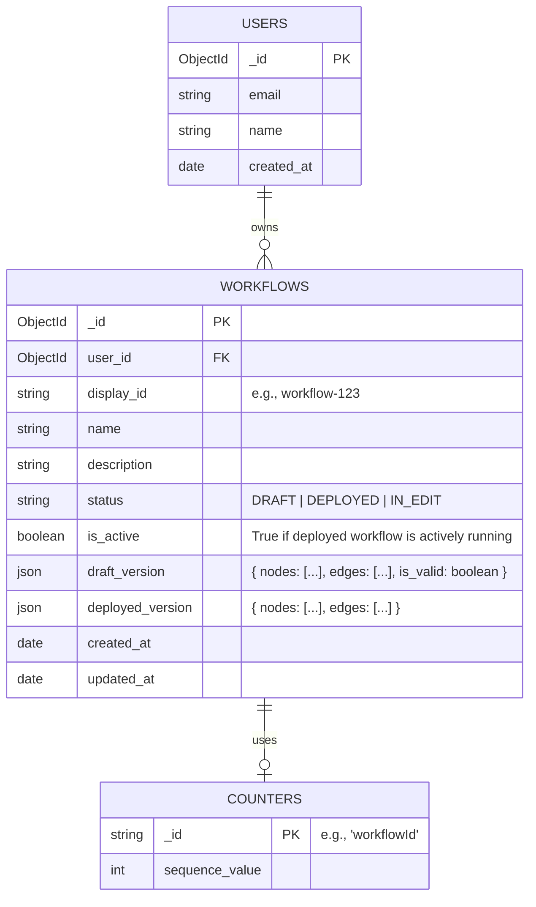

# Database Design for Trading Workflow Automation

This document outlines the optimized database schema for the workflow automation system. Given that we are using MongoDB, we leverage **Document Embedding** for nodes and edges to ensure atomic updates, eliminate complex transactions, and maximize read performance.

## Entity Relationship Diagram



## Collections & Schema

### 1. Users (`users`)

Essential for authentication, securing workflows, and acting as the root entity for future credential vaults.

- `_id`: ObjectId
- `email`: String (Unique)
- `name`: String
- `created_at`: Date

### 2. Workflows (`workflows`)

This is the core collection. Instead of fragmenting nodes and edges into separate collections, **we embed them directly into the workflow document**. This is highly optimized for MongoDB because:

1. Loading a workflow in the canvas requires only **one database query**.
2. Deploying a workflow is an **atomic operation** (simply copying the draft array to the deployed array in the same document).
3. We avoid the overhead of joining or managing multi-document transactions for versioning.

**Schema:**

- `_id`: ObjectId
- `user_id`: ObjectId (Ref: Users)
- `display_id`: String (Indexed, Unique) -> _e.g., "workflow-123"_
- `name`: String
- `description`: String
- `status`: String (Enum: `DRAFT`, `DEPLOYED`, `IN_EDIT`)
- `is_active`: Boolean (Tracks if a deployed workflow is currently turned "on")
- `draft_version`: Object
  - `is_valid`: Boolean (Tracks if the current draft passes graph validation)
  - `nodes`: Array of `AppNode` objects
    - `id`: String (ReactFlow UUID)
    - `type`: String (e.g., 'price-trigger', 'hyperliquid')
    - `position`: Object `{ x: Number, y: Number }`
    - `data`: Object `{ name: String, description: String, kind: "action"|"trigger", metadata: Object }`
  - `edges`: Array of `AppEdge` objects
    - `id`: String (ReactFlow UUID)
    - `source`: String (Source Node ID)
    - `target`: String (Target Node ID)
    - `sourceHandle`: String
    - `targetHandle`: String
- `deployed_version`: Object (Null until deployed)
  - `nodes`: Array of `AppNode` objects (Snapshot of nodes at time of deploy)
  - `edges`: Array of `AppEdge` objects (Snapshot of edges at time of deploy)
- `created_at`: Date
- `updated_at`: Date

---

## Technical Strategy & Mechanisms

### Generating the `display_id`

We use the **Counter Collection Pattern**:

1. Create a `counters` collection with a document: `{ _id: 'workflowId', sequence_value: 0 }`.
2. When creating a new workflow, use an atomic `findOneAndUpdate` to increment `sequence_value` by 1.
3. Append the returned value to the prefix: `"workflow-" + sequence_value`.

### Simplified Versioning Lifecycle (Atomic Embeds)

Because we embed `draft_version` and `deployed_version`, managing states is trivial:

- **Creation:** A new workflow starts with `status: DRAFT`. The user's canvas edits are constantly saved to `draft_version`. `deployed_version` is null.
- **Deploying:** We run graph validation on `draft_version`. If valid, we do a single atomic update: copy `draft_version` to `deployed_version`, and set `status: DEPLOYED`.
- **Editing After Deploy:** If a user modifies the canvas of a DEPLOYED workflow, we save changes to `draft_version` and set `status: IN_EDIT`. The backend execution engine remains completely unaffected because it only reads from `deployed_version`.
- **Re-Deploying:** We overwrite `deployed_version` with the latest `draft_version` and reset status to `DEPLOYED`.

### Querying the List View Efficiently

When rendering the "My Workflows" page, we do not need to download the heavy node/edge arrays. We simply use a MongoDB **Projection** to exclude them, making the query lightning fast:

```javascript
db.workflows.find(
  { user_id: currentUserId },
  { draft_version: 0, deployed_version: 0 }, // Exclude heavy payloads
);
```

### Graph Validation Criteria

Before allowing a Draft to be copied to Deployed:

1. Count of nodes where `data.kind == 'trigger'` must be `>= 1`.
2. Graph traversal (BFS/DFS) starting from trigger nodes must be able to reach all other action nodes (preventing orphaned actions).

---

## Future Collections Scope

3. **Credentials (`credentials`)**: Will act as a secure vault storing encrypted external tokens (like Solana tokens, OAuth tokens, API keys) linked to a specific `user_id`.
4. **Executions (`executions`)**: Will log historical runs, linked to `workflow_id`, storing inputs, outputs, timestamps, and error traces. Will execute exclusively against the `deployed_version.nodes` array.
