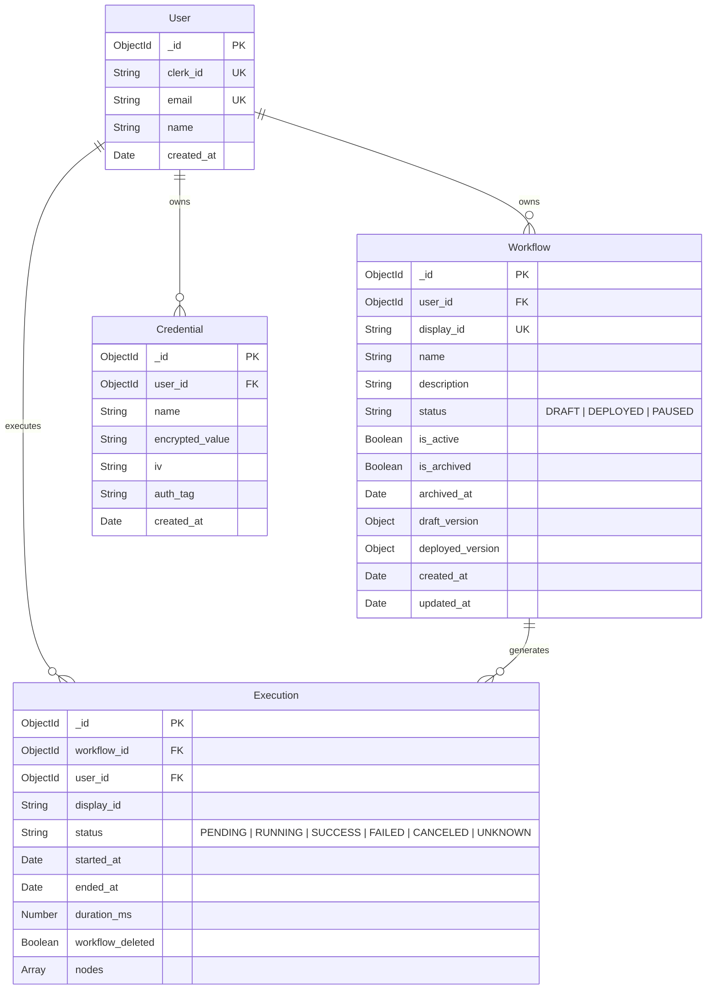

# Database Architecture

The data layer uses MongoDB via Mongoose for persistent storage. The schema enforces separation between draft and deployed workflow versions, AES-256-GCM credential encryption, and execution logging.

## Entity Relationship

## Core Models

### User
Authentication is handled by Clerk. A Svix-verified webhook (`user.created`, `user.updated`, `user.deleted`) syncs Clerk user profiles to the MongoDB `User` collection. This enables relational references for workflows and credentials without runtime requests to Clerk.

### Workflow
Workflows maintain a two-version state structure:
- `draft_version`: Updated directly by canvas edits. Contains the current graph configuration (`nodes`, `edges`, `is_valid`).
- `deployed_version`: A frozen snapshot created only when the workflow passes BFS validation and is deployed. The execution engine reads exclusively from this snapshot.
- `status`: Lifecycle state (`DRAFT`, `DEPLOYED`, `PAUSED`).
- `is_active`: Boolean flag determining whether the engine processes triggers for the workflow.
- `is_archived`: Soft-delete flag. Archiving resets `status` to `DRAFT` and `is_active` to `false`.

### Credential (Vault)
Stores external exchange API credentials (e.g., Backpack, Hyperliquid, Lighter).
- **Encryption:** Values are encrypted with `AES-256-GCM` before database persistence.
- **Storage:** Persists `encrypted_value`, initialization vector (`iv`), and authentication tag (`auth_tag`).
- **Key Management:** The 256-bit encryption key (`ENCRYPTION_KEY`) is stored exclusively in process environment variables.

### Execution
Maintains audit logs for workflow runs. Tracks execution-level metadata (`status`, `started_at`, `ended_at`, `duration_ms`) and an array of individual node execution records (`node_id`, `status`, `input_data`, `output_data`, `error`).
