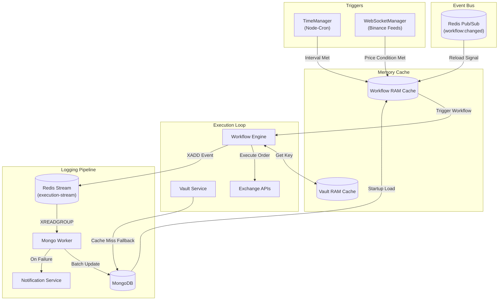

# Execution Engine Architecture

The Executor is an independent Node.js background process decoupled from the REST API. It ingests market data, evaluates trigger conditions, and executes trading strategies without affecting API latency.

## Execution Lifecycle

## Subsystems

### 1. In-Memory Caching
To eliminate database read latency from execution paths, the executor stores all deployed workflows, trigger criteria, and pre-decrypted credentials in RAM.
- **TriggerLoader:** Populates the cache on startup.
- **Cache Invalidation:** Subscribes to the Redis Pub/Sub channel `workflow:changed`. When the API server publishes an update event, `TriggerLoader` refreshes cached triggers, active timers, and WebSocket subscriptions.

### 2. Trigger Evaluation
Execution uses direct event-driven evaluation rather than database polling:
- **TimeManager:** Registers `node-cron` intervals for schedule-based workflows. On interval expiration, the workflow is submitted to the engine.
- **WebSocketManager:** Maintains persistent WebSockets to Binance market feeds. Inbound ticker prices are evaluated against in-memory trigger thresholds.
- **Debouncing:** Prevents concurrent duplicate executions while a workflow is actively running.

### 3. Execution Engine
The engine evaluates the workflow graph sequentially:
- **Credential Decryption:** Action nodes access decrypted credentials preloaded in `VaultService` RAM cache. If a cache miss occurs, the secret is loaded from MongoDB, decrypted with AES-256-GCM, and cached.
- **Error Handling:** If an exchange request fails or input validation fails, the current node is marked `FAILED` and graph execution terminates immediately.

### 4. Asynchronous State Synchronization
Execution logging is decoupled from the main execution path:
- **RedisLogger:** Pushes state transitions (execution started, node completed, workflow failed) to the Redis Stream `execution-stream` using non-blocking `XADD` operations.
- **MongoWorker:** Runs a dedicated Redis consumer group (`mongo-sync-group`) that reads stream messages and commits updates to MongoDB.
- **Failure Notification:** When `MongoWorker` processes a global `FAILED` state, it triggers `NotificationService` to send an alert email via Nodemailer.
