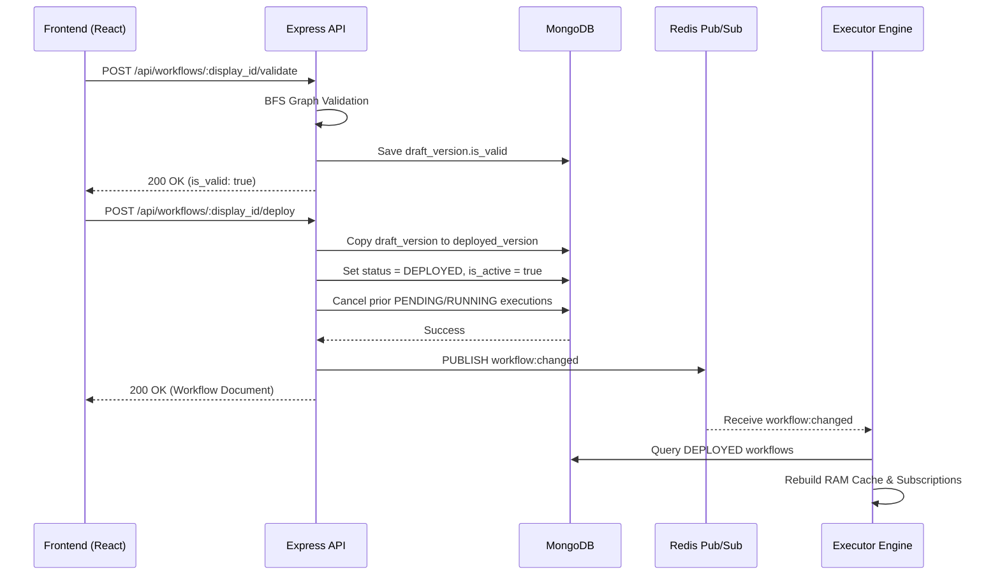

# REST API Specification

The backend provides an Express.js REST API. Application routes require authentication via Clerk JWT middleware. The webhook route is public and authenticated via Svix signature verification.

## Deployment Flow

## Route Endpoints

### `/api/workflows`
Manages workflow configuration, versioning, and lifecycle states.

- `GET /`: Returns a paginated list of workflows for the authenticated user (filters: `IN_PROGRESS`, `DEPLOYED`, `ARCHIVED`). Omits heavy graph node/edge arrays for listing performance.
- `POST /`: Creates an empty workflow with an auto-incremented `display_id` (e.g., `workflow-1`).
- `GET /:display_id`: Returns the full workflow document including draft and deployed graphs.
- `PUT /:display_id`: Updates workflow metadata (`name`, `description`) and graph definitions (`nodes`, `edges`). Modifying the graph automatically resets `draft_version.is_valid` to `false`.
- `POST /:display_id/validate`: Runs BFS graph traversal to verify that at least one trigger node exists and all action nodes are reachable.
- `POST /:display_id/deploy`: Promotes `draft_version` to `deployed_version`, sets `status` to `DEPLOYED`, sets `is_active` to `true`, cancels obsolete active executions, and publishes a `workflow:changed` event to Redis.
- `POST /:display_id/toggle`: Toggles a deployed workflow between `DEPLOYED` (`is_active: true`) and `PAUSED` (`is_active: false`), then notifies the executor via Redis.
- `POST /:display_id/archive`: Soft-deletes a workflow (`is_archived: true`), cancels active executions, and marks executions with `workflow_deleted: true`.
- `POST /:display_id/unarchive`: Restores an archived workflow back to active draft status.

### `/api/credentials`
Manages exchange API keys and authorization secrets.

- `GET /`: Returns all credentials owned by the user with decrypted plaintext values for configuration.
- `POST /`: Encrypts `name` and `value` using AES-256-GCM and persists the record to MongoDB.
- `DELETE /:id`: Deletes a credential record by its MongoDB `_id`.

### `/api/executions`
Provides execution history and cancellation controls.

- `GET /`: Returns a paginated list of all executions across all workflows owned by the user.
- `GET /workflow/:display_id`: Returns paginated execution history for a specific workflow.
- `GET /:display_id`: Returns a single execution document including node-level status, input/output data, and errors.
- `POST /:display_id/cancel`: Cancels an active (`PENDING` or `RUNNING`) execution.

### `/api/webhooks/clerk`
Public webhook endpoint secured by Svix cryptographic signature verification (`svix-id`, `svix-timestamp`, `svix-signature`).
- `user.created` / `user.updated`: Upserts the corresponding `User` record in MongoDB.
- `user.deleted`: Removes the user and cascades deletion across owned `Workflow`, `Credential`, and `Counter` documents.
